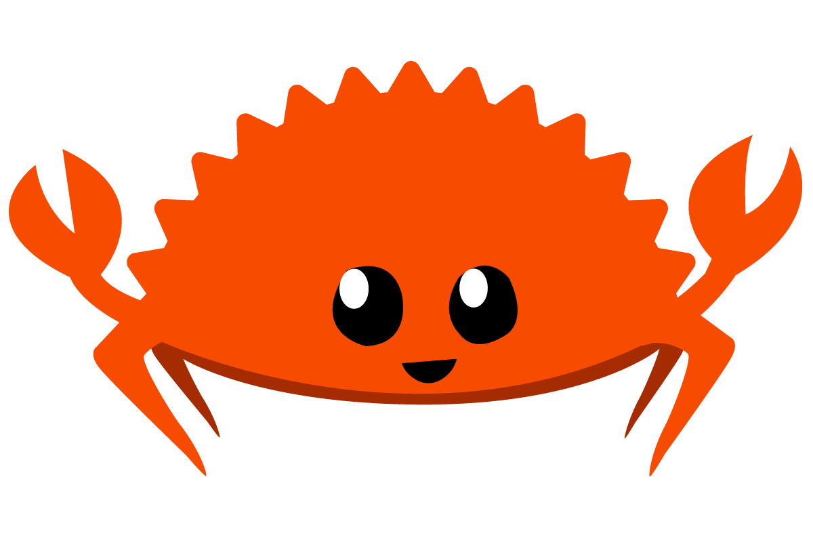

# <center> Ejercicios de Rust </center>

<header style="display:flex; justify-content: space-around; align-items: center; margin: 24px auto;">

 </header>


Este repositorio es una recopilación de ejercicios realizados a partir de la documentación de [Rust](https://doc.rust-lang.org/book/title-page.html).

Salvo el primer ejercicio de Hello World, para compilar el resto de ejercicios, hay que tener instalados Cargo y Rust.

## Descarga y compilación - Entorno Linux

Al igual que sucede con otros lenguajes como C, Rust hay que compilarlo antes de ejecutarlo. Si deseas compliar un ejercicio, ve al directorio.

```bash
bash
cd guessing_game
``` 

Una vez dentro, solo hay que compilar el programa con Cargo, con el siguiente comando

```bash
bash
cargo build
```

Si hubiera algún error por las dependencias del archivo Cargo.toml, la terminal indicaría el error y cómo solucionarlo. Si no hay ningún problema solo habría que ejecutar:

```bash
cargo run
```

Con eso, se ejecutaría la aplicación si no se especifica lo contrario en su README.MD

### Listado de ejercicios

- Hello World
- Guessing Game 1
